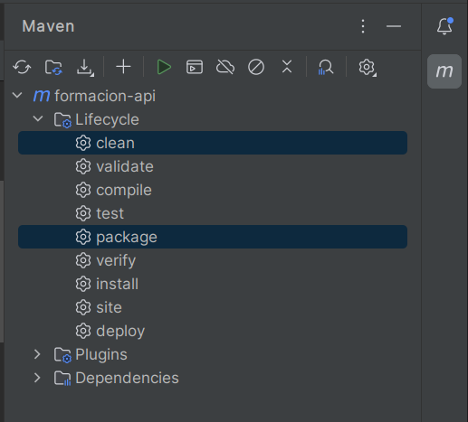

# 🎉️ Bienvenido a la formación de Arteco 🎉️

---

Este proyecto es una aplicación web desarrollada en Java, Springboot que cuenta con un endpoint de ejemplo. En este repositorio
encontrarás el código fuente de la aplicación,una guía de inicio rápido, así como las prácticas a realizar.

# **Índice**

1. [Guía de inicio rápido️](#id1)
2. [Formación](#id2)
    1. [Estructura del repositorio](#id2.1)
    1. [Instrucciones para trabajar en el repositorio](#id2.2)

<div id='id1' />

# 🚀️ Guía de inicio rápido 🚀️

---

Para empezar a realizar las prácticas de este proyecto, deberás seguir los siguientes pasos:

### 1. Haz un fork de este repositorio en tu cuenta de Github.

### 2. Clona el repositorio forkeado en tu ordenador.

```
   git clone https://github.com/tu-usuario/formacion-api.git
```

### 2. Abre una terminal en la carpeta del proyecto y ejecuta el siguiente comando para compilar y empaquetar la aplicación:

###### Terminal

```
mvn clean package
```

###### IntelliJ IDE



### 3. Iniciar la aplicación ejecutando el siguiente comando:

###### Terminal

```
java -jar target/formacion-api.jar
```

###### IntelliJ IDE


### 4. Abre tu navegador web e ingresa la siguiente URL para ver el endpoint de ejemplo:

```
http://localhost:8080/api/v1/books
```

<div id='id2' />

# 📚 Formación 📚

---

Bienvenido al repositorio de formación de Arteco. En este repositorio encontrarás todas las prácticas y ejercicios que
debes realizar para mejorar tus habilidades y conocimientos en el ámbito tecnológico.

<div id='id2.1' />

### Estructura del repositorio

El repositorio cuenta con las siguientes ramas:

- **main:** es la rama principal del repositorio. Aquí se encuentra la información del proyecto y no se debe modificar.
- **dev:** es la rama de desarrollo del proyecto. Aquí se irán mergeando las prácticas realizadas, siempre y cuando sean aprobadas
  por el tutor de la empresa.
- **practica/ejercicio_X:** en estas ramas se encuentra toda la información sobre la práctica que se debe resolver. Cada práctica
  tiene su propia rama, identificada por el nombre "practica/ejercicio_X". Una vez resuelta la práctica, se debe lanzar un Pull
  Request contra la rama "dev".

<div id='id2.2' />

### Instrucciones para trabajar en el repositorio

Para comenzar a trabajar en el repositorio, deberás seguir los siguientes pasos:

1. Haz un fork de este repositorio en tu cuenta de Github.
2. Clona el repositorio forkeado en tu ordenador.

   ```
      git clone https://github.com/tu-usuario/formacion-api.git
   ```
3. Cambiate a la rama de la práctica que vayas a resolver. Por ejemplo:

   ```
      git checkout -b practica/ejercicio_X
   ```
4. Resuelve la práctica y haz un `commit push` con tus cambios.

   ```
      git add .
      git commit -m "Feature:Resolución de la práctica X"
   ```
5. Crea un Pull Request desde la rama "practica/ejercicio_X"  a la rama "dev". Asegúrate de incluir una descripción clara y
   concisa de los cambios realizados.

Una vez que tu Pull Request sea aprobada, tus cambios se fusionarán con la rama "dev" y podrás continuar con la siguiente
práctica.

¡Gracias por formar parte de nuestra formación continua! Si tienes alguna duda o pregunta, no dudes en ponerte en contacto con el
tutor de la empresa.
